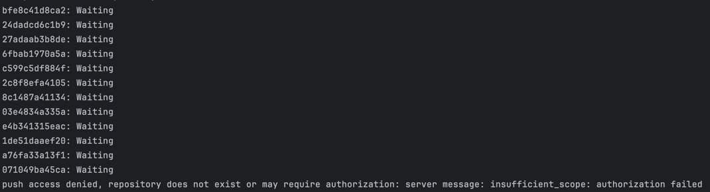
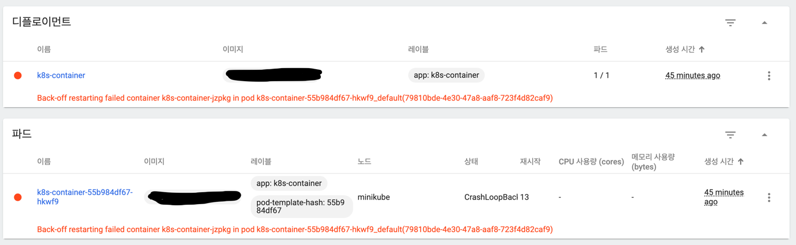
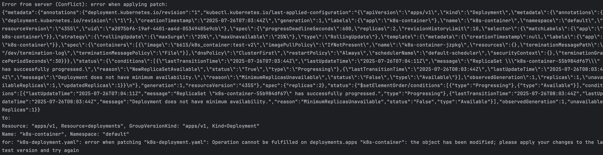

# k8s_container

## 1. FastAPI App 만들기
"/" 접근 시 {"message": "Hello World"} 출력
```
  from fastapi import FastAPI

  app = FastAPI()

  @app.get("/")
  async def root():
  return {"message": "Hello World"}
```
```
uvicorn main:app --reload
```

## 2. Container 보관할 docker hub repository 만들기
- docker hub 접속 후 public repository 생성 (이하 pub_repo)

## 3. App Container 만들고 푸시하기
```
docker build -t pub_repo:test .
docker push pub_repo:test
```

## 4. Mini kube 설치
https://minikube.sigs.k8s.io/docs/start/?arch=%2Fmacos%2Farm64%2Fstable%2Fhomebrew
```
# minikube 설치
brew install minikube

# cluster 시작
minikube start  

# cluster 상호작용
kubectl get po -A

# 대시보드 보기
minikube dashboard
```

## 5. 애플리케이션 배포
```
# deployment 생성
kubectl create deployment k8s-container --image=pub_repo:test

# 80포트에 노출
kubectl expose deployment k8s-container --type=NodePort --port=80
```

# Trouble Shooting
## 1. Docker hub push : authorization failed
- 
- `push access denied, repository does not exist or may require authorization: server message: insufficient_scope: authorization failed`
- -> docker hub에 이미지를 푸시하기 위한 인가 요청이 실패함
- `docker login`
- -> docker login 후 재시도 -> 해결

## 2. k8s deployment 생성 : deployment 명명 규칙 위배
- `kubectl create deployment pub_repo --image=pub_repo:test`
- 위 명령 후 deployment 명명 규칙에 언더바가 포함될 수 없다는 오류 발생
- `kubectl create deployment pub-repo --image=pub_repo:test`
- 위처럼 변경 후 해결

## 3. kubectl expose deployment 실패 : 이미지 이름 매칭 실패
- 에러 메시지 :
- `Error response from daemon: manifest for pub_repo:test not found: manifest unknown: manifest unknwon`
- 인터넷 검색 결과 해당 버전, 이미지를 찾을 수 없다는 오류
- docker hub 들어가보니 이미지 이름 오타 발견 (container -> conatiner)
- 올바른 이름으로 이미지 빌드 및 push 후 deployment 재생성 및 expose -> 해결

## 4. k8s 비정상 종료 및 재시작 시도 : Back-off restarting failed container
- `Back-off restarting failed container k8s-container-jzpkg in pod k8s-container-55b984df67-hkwf9_default(79810bde-4e30-47a8-aaf8-723f4d82caf9)`
- 
### 1. kubectl describe pod [pod] -n [namespace] 명령어로 pod 상태 확인
- `kubectl describe pod k8s-container-55b984df67-hkwf9 -n default`
- Warning BackOff 에러 -> 컨테이너 안에서 실행되는 애플리케이션 로그 확인 필요
### 2. kubectl logs [pod] -n [namespace] -c [container] --previous # previous로 바로 직전에 종료된 컨테이너의 로그 확인
- `kubectl logs k8s-container-55b984df67-hkwf9 -n default -c k8s-container-jzpkg --previous`
- -> 다음 에러 내용 확인
- ```
  RuntimeError: To use the fastapi command, please install "fastapi[standard]":

        pip install "fastapi[standard]"
  ```
- -> 의존성 에러로 확인, requirements.txt에서 fastapi -> fastapi[standard]로 변경 후 재빌드
### 3. kubectl delete pod [pod] -n [namespace]로 pod 삭제 및 재생성 유도
- 실패 -> 똑같은 에러 발생
### 4. docker run [image]로 이미지 실행 확인
- -> 정상 구동됨을 확인
- pod 삭제 뿐 아니라 deployment 재생성이 필요한지 확인 (이미지 교체가 원활히 되지 않은 것으로 생각)
- gemini 도움 -> 생각한 원인은 맞으나 deployment 재생성보다 deployment.yaml에서 image 태그를 직접 바꿔주는 것 추천
### 5. 현재 상태의 deployment 추출 및 image 수동 변경 후 적용
- `kubectl get deployment k8s-container -n default -o yaml > k8s-deployment.yaml`
- k8s-deployment.yaml 파일에서 image 부분 수동 변경
- `kubectl apply -f k8s-deployment.yaml`
- 해결 완료

## 5. replica 수 조정 위해 yaml 변경 및 적용 : the object has been modified
- 위 문제 해결 후 replica 구성을 위해 replica: 1 -> 2로 변경 후 `kubectl apply -f k8s-deployment.yaml`
- 
- 4번 문제 해결 후 적용했을 때, cluster 버전이 업데이트되어 현재의 yaml 파일이 맞지 않음을 확인
- yaml 재추출 (`kubectl get deployment`) 후 replica 수정, 재배포
- 해결 완료